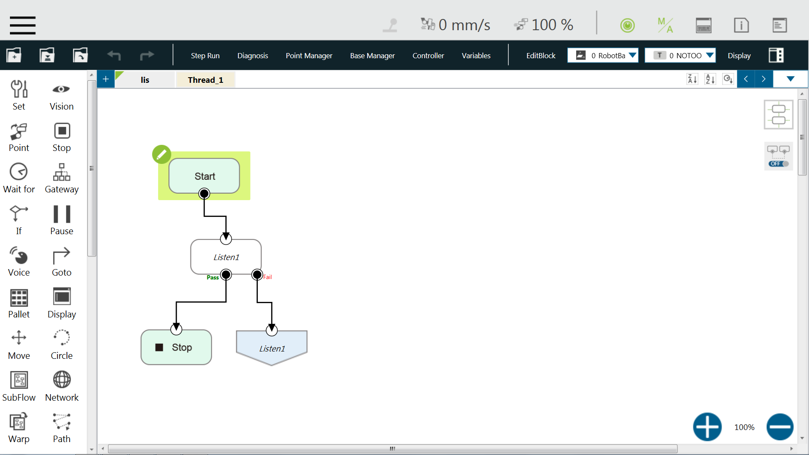
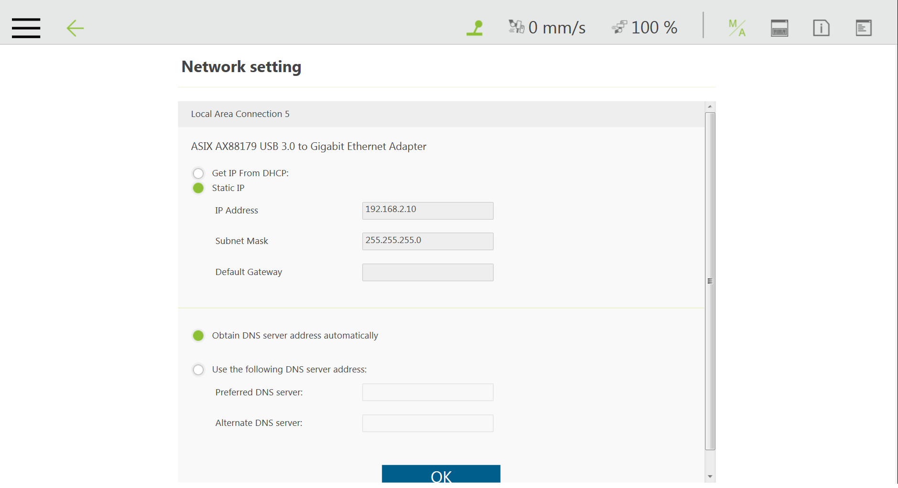

# __TM ROS Driver__

## __1. Overview__

The TM Robot is a state-of-the-art production tool that is highly compatible and flexible to collaboration between human and machine. The Robot Operating System (ROS) provides abundant libraries and tools which can be utilized to reduce the cost of trivial development software tool and build robot applications without struggling. Our TM ROS driver provides nodes for communication with Techman Robot controllers, data including robot states, images from the eye-in-hand camera and URDF models for various robot arms via _TMFlow_.

## __2. Feature__

### __ROS1 Driver__

The TM ROS driver connects to _TMFlow ethernet slave_ to control _TMFlow project_. Robot state is transmitted through this connection.  A working driver also connects to a _listen node_ (running at a _TMFlow project_) at the same time. To control the robot locomotion ,IO ,etc., the TM ROS driver sends robot script (_TM Robot Expression_) through this connection.
More information about _TM Robot Expression_ and _ethernet slave_, see [Expression Editor and Listen Node.pdf]
The TM ROS driver for ROS1 is a __single ROS node__ which creates a ROS interface such as topics and services:

> __Action Server__
>
> - An  action interface on _/follow_joint_trajectory_ for seamless integration with MoveIt
>
> __Topic Publisher__
>
> - publishes feedback state on _/feedback_states_  
feedback state include robot position, error code, io state, etc.
(see _tm_msgs/msg/FeedbackState.msg_)  
> - publishes joint states on _/joint_states_  
> - publishes tool pose on _/tool_pose_
>
> __Service Server__
>
> - _/tm_driver/send_script_ (see _tm_msgs/srv/SendScript.srv_) :  
send robot script (_TM Robot Expression_) to _listen node_  
> - _/tm_driver/set_event_ (see _tm_msgs/srv/SetEvent.srv_) :  
send "Stop", "Pause" or "Resume" command to _listen node_  
> - _/tm_driver/set_io_ (see _tm_msgs/srv/SetIO.srv_) :  
send digital or analog output value to _listen node_  
> - _/tm_driver/set_position (see _tm_msgs/srv/SetPosition.srv_) :  
send motion command to _listen node_, the motion type include PTP, LINE, CIRC ans PLINE, the position value is joint angle(__J__) or tool pose(__T__), see [[Expression Editor and Listen Node.pdf]]
>
> __Usage__
>
> For example, execute the launch file to enable the driver to connect to tm5-900 robot  
>
> ```bash
> roslaunch tm_driver tm5_900_bringup.launch robot_ip:=YOUR_ROBOT_IP_ADDRESS
> ```
>

## __3. Usage__

### __TMFlow setup__

> __Listen node__
>
> 1. Create a flow project; then choose the __listen__ node and the __Goto__ node
> 
>
> 2. Go to the __System/Network setting__ page  
Type network parameters of device for ROS
> 
>
> 3. Go to the __Setting/Connection__ page  
Enable the __Ethernet Slave__ item  
Click on the __Data Table Setting__ button and check the following boxes:
>
>       - [x] Robot_Error
>       - [x] Project_Run
>       - [x] Project_Pause
>       - [x] Safeguard_A
>       - [x] ESTOP
>       - [x] Camera_Light
>       - [x] Error_Code
>       - [x] Joint_Angle
>       - [x] Coord_Robot_Flange
>       - [x] Coord_Robot_Tool
>       - [x] TCP_Force
>       - [x] TCP_Force3D
>       - [x] TCP_Speed
>       - [x] TCP_Speed3D
>       - [x] Joint_Speed
>       - [x] Joint_Torque
>       - [x] Project_Speed
>       - [x] MA_Mode
>       - [x] Robot Light
>       - [x] Ctrl_DO0~DO7
>       - [x] Ctrl_DI0~DI7
>       - [x] Ctrl_AO0
>       - [x] Ctrl_AI0~AI1
>       - [x] END_DO0~DO3
>       - [x] END_DI0~DI2
>       - [x] END_AI0
>
>       
>
>
### __TM ROS driver usage__

> Change the current working directory of the terminal to your workspace`<workspace>`and set up the environment.
>
> ```bash
> cd <workspace>
> source devel/setup.bash
> ```
>
> Manipulate the virtual TM robot:
>
> ```bash
> roslaunch tm5_900_moveit_config tm5_900_moveit_planning_execution.launch sim:=True
> ```
>
> You can also manipulate TM robot in the real world:
>
> ```bash
> roslaunch tm5_900_moveit_config tm5_900_moveit_planning_execution.launch sim:=False robot_ip:=<robot_ip>
> ```
>
> The parameter `<robot_ip>` means the IP address of the robot control pc.


## GUI debug and demo
This GUI shows up tm_driver connection status, sct sta svr messages and robot status. You can use this GUI to check driver and robot connect status and send re-connect command and base on this GUI to modify.

### How to use it
1. Create a folder ``~/tm_driver`` by type<br/>
``mkdir ~/tm_driver``<br/>
``cd ~/tm_driver``
2. Download this package by using git<br/>
``git clone https://github.com/TechmanRobotInc/tmr_ros1.git``<br/>
3. Build the source code and set the path<br/>
``catkin_make``<br/>
``source ./devel/setup.bash``<br/>
4. Open a terminal and type<br/>
``roscore``
4. Open another terminal and type<br/>
``rosrun tm_driver tm_driver <robot_ip>``<br/>
<robot_ip> is tm robot ip address, you can get it by TM Flow, for example 192.168.10.2
5. Open another terminal and type<br/>
``rosrun ui_for_debug_and_demo robot_ui``<br/>

### UI description
1. When ``is_srv_connect`` and ``is_sct_connect`` are true, it means the all connection is success.
2. If ``is_srv_connect`` is false, you should check the data table is correct or not.
3. If ``is_sct_connect`` is false, you should check whether you run the project or not.
4. If ``is_srv_connect`` and ``is_sct_connect`` are true, but ``robot link`` is false. It means you connect the TM project, but you are not in listen node, so you when you send the move command, it doesn't work.
5. When you send a command or click ``"change control box IO"``, you can see ``"Robot Response"`` add a response item, the item details you can reference ``SctResponse.msg``, ``StaResponse.msg`` and ``SvrResponse.msg``.
6. You can click ``"clear"`` to clear the old response items.
7. If you didn't open the ``tm_ros_driver``, you will see all items show ``"Not ini"``.